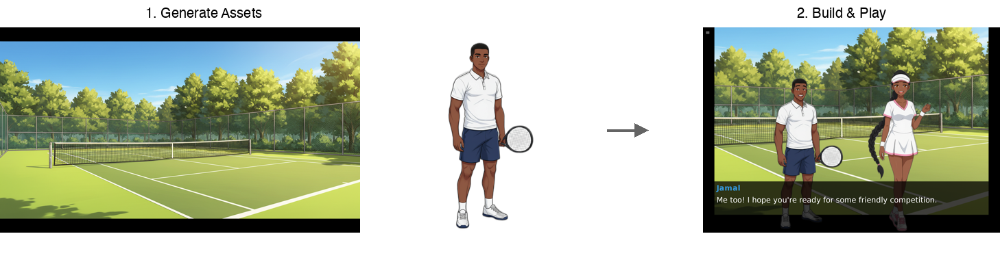
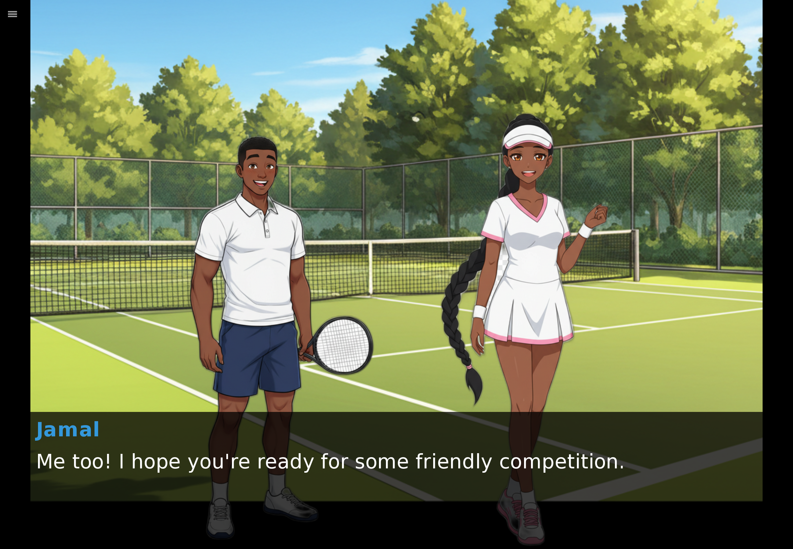
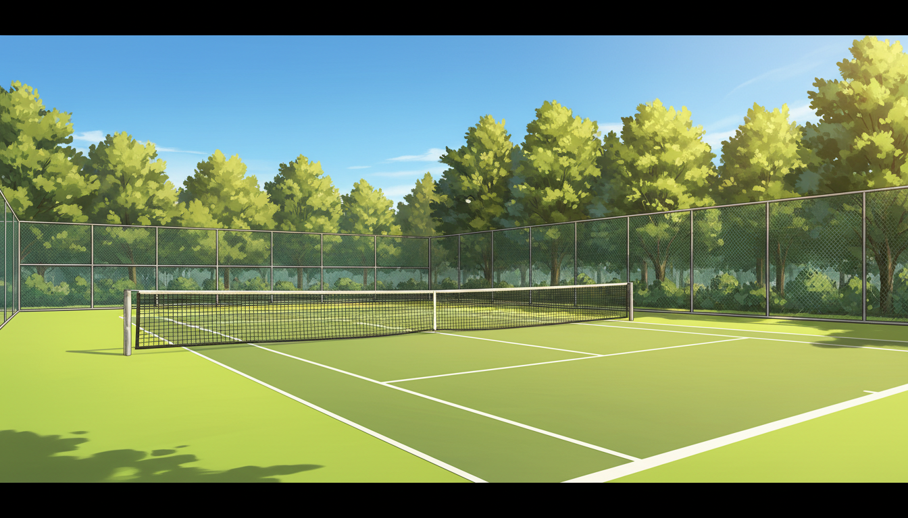
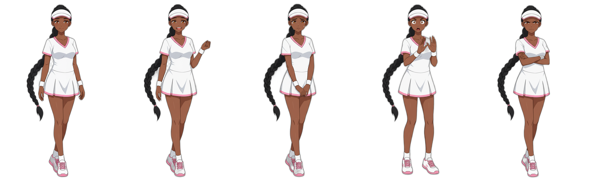
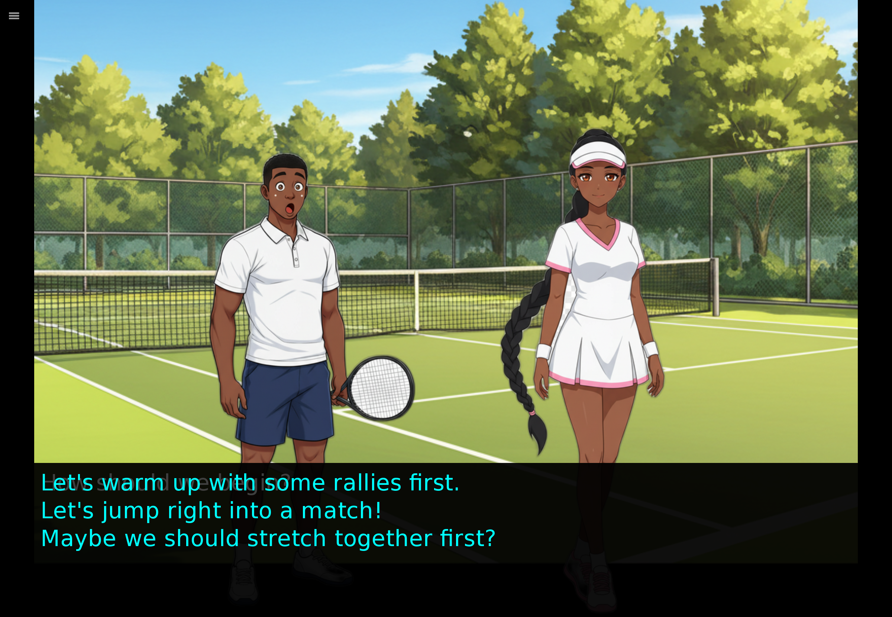

# 🎮 Ren'Py MCP Server

> **Build visual novels with AI!** An [Model Context Protocol](https://modelcontextprotocol.io/) server that lets AI assistants create complete Ren'Py visual novel games with images, dialogue, branching stories, and web deployment.

[](https://github.com/banjtheman/renpy_mcp_server)
[](https://www.python.org/downloads/)
[](https://modelcontextprotocol.io/)

<p align="center">
  
</p>

## 🎬 See It In Action

### 🎥 Demo Video

<p align="center">
  <a href="media/videos/claude_renpy_mcp.mp4">
    
  </a>
</p>
<p align="center"><em>▶️ Click to watch Claude create a complete visual novel in minutes!</em></p>

### 📸 Example Outputs

**Generated Backgrounds (16:9)**

<p align="center">
  
  
</p>

**Character Sprites with Multiple Emotions (2:3)**

<p align="center">
  
</p>
<p align="center"><em>One character with 5 emotions (neutral, happy, sad, surprised, angry) - all generated in a single API call!</em></p>

**Final Playable Games**

<p align="center">
  
  
</p>
<p align="center"><em>Fully playable web games with branching dialogue and player choices</em></p>

## ✨ Features

- 🎨 **AI Image Generation** - Backgrounds (16:9) and characters (2:3) using Gemini 2.5 Flash Image
- 🎭 **Emotion System** - Generate 5 emotions per character in one API call (neutral, happy, sad, surprised, angry)
- 📝 **Script Generation** - AI writes complete Ren'Py scripts with dialogue, choices, and branching paths
- 🌐 **Web Builds** - Automatically compile to playable web games
- 🎬 **Live Preview** - Local HTTP server to test games instantly
- 🪄 **Transparent Sprites** - Automatic background removal for character sprites

## 🚀 Quick Start

### Automated Setup

```bash
# Clone and setup everything automatically
git clone https://github.com/banjtheman/renpy_mcp_server.git
cd renpy_mcp_server
./setup.sh

# Test your installation
./test_setup.sh

# (Optional) Test image generation directly
uv run python test_nano_banana.py
```

The `setup.sh` script will:
- ✅ Install Python dependencies
- ✅ Download and setup Ren'Py SDK (OS-specific)
- ✅ Automatically install web support module
- ✅ Help configure Gemini API key
- ✅ Create MCP configuration files
- ✅ Test everything works

### MCP Client Configuration

Add the server to your MCP client configuration (Claude Desktop, Cursor, etc.):

```json
{
  "mcpServers": {
    "renpy_mcp_server": {
      "command": "uv",
      "args": [
        "--directory",
        "/FULL_PATH_TO_RENPY_MCP_SERVER",
        "run",
        "renpy-mcp-server"
      ],
      "env": {
        "GEMINI_API_KEY": "${GEMINI_API_KEY}",
        "RENPY_SDK_PATH": "${RENPY_SDK_PATH}"
      }
    }
  }
}
```

**Replace:**
- `/FULL_PATH_TO_RENPY_MCP_SERVER` - Full path to this repository
- `${GEMINI_API_KEY}` - Your Gemini API key
- `${RENPY_SDK_PATH}` - Path to Ren'Py SDK (e.g., `/path/to/renpy-8.4.1-sdk`)

**Or use environment variables:**
```bash
export GEMINI_API_KEY="your-api-key"
export RENPY_SDK_PATH="/path/to/renpy-8.4.1-sdk"
```

### Manual Setup

1. **Install Dependencies**
   ```bash
   uv sync
   ```

2. **Setup Ren'Py SDK**
   - SDK and web module are automatically downloaded during setup
   - No manual launcher interaction needed

3. **Get Gemini API Key**
   - Visit [Google AI Studio](https://aistudio.google.com/app/api-keys)
   - Create an API key

4. **Configure Environment**
   ```bash
   export RENPY_SDK_PATH="/path/to/renpy-sdk"
   export GEMINI_API_KEY="your-api-key"
   ```

5. **Add to MCP Client**
   - See "MCP Client Configuration" section above
   - The server will start automatically when your MCP client connects

## 🎮 Usage

### Basic Workflow

1. **Create a project**
   ```
   create_project(name="my_vn")
   ```

2. **Generate assets**
   ```
   generate_background(project_name="my_vn", description="Cozy café interior, evening time...")
   generate_character(project_name="my_vn", character_name="alice", description="Friendly barista...", generate_emotions=True)
   ```

3. **Write the story**
   ```
   generate_script(project_name="my_vn", script_name="intro", script_content="label intro:\n    scene bg cafe\n    show alice happy\n    Alice \"Welcome!\"\n    return")
   ```

4. **Inspect and edit** (optional)
   ```
   list_project_files(project_name="my_vn")  # See all files
   read_project_file(project_name="my_vn", file_path="intro.rpy")  # Read a script
   edit_project_file(project_name="my_vn", file_path="intro.rpy", content="...")  # Update it
   ```

5. **Build and preview**
   ```
   build_project(project_name="my_vn")
   start_web_preview(project_name="my_vn")
   ```

## 📚 Documentation

- **[Examples](examples/README.md)** - Claude Agent SDK and Strands integration examples

## 🤝 Contributing

We welcome contributions! See [CONTRIBUTING.md](CONTRIBUTING.md) for guidelines.

## 📄 License

MIT License - see [LICENSE](LICENSE) for details.

---

**Happy visual novel creating! 🎮✨**