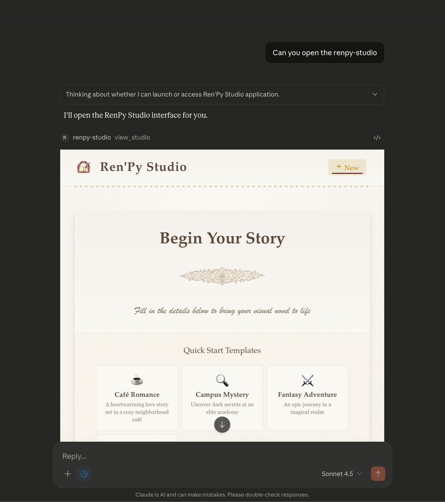
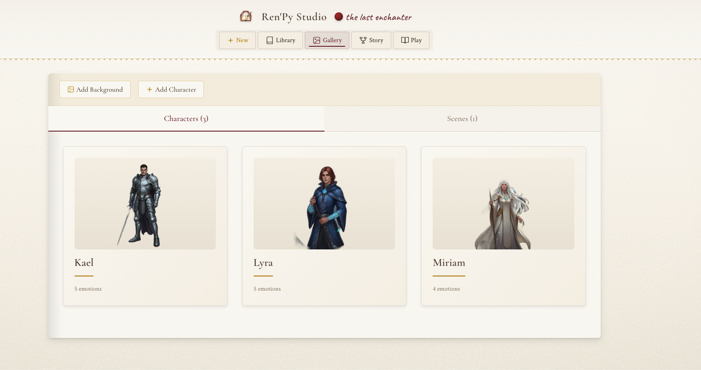
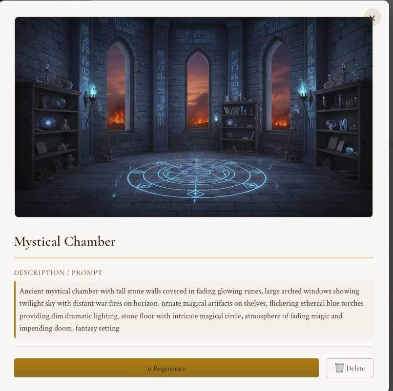
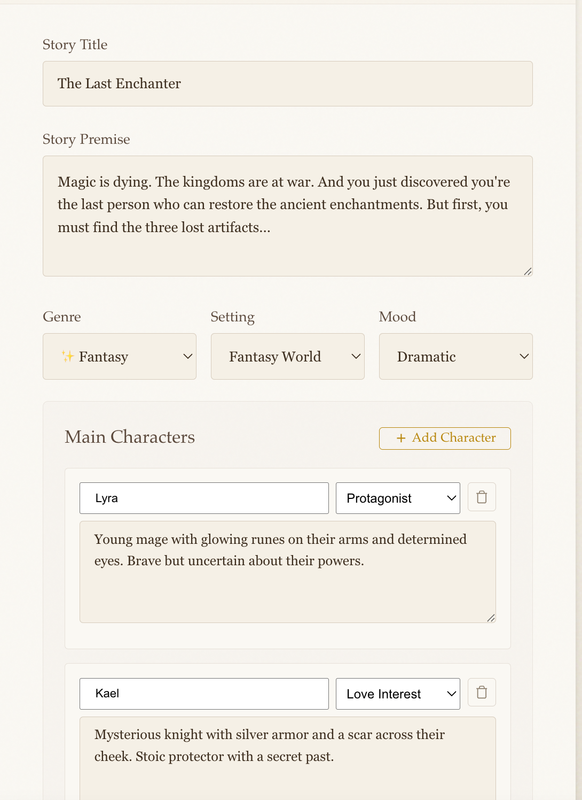
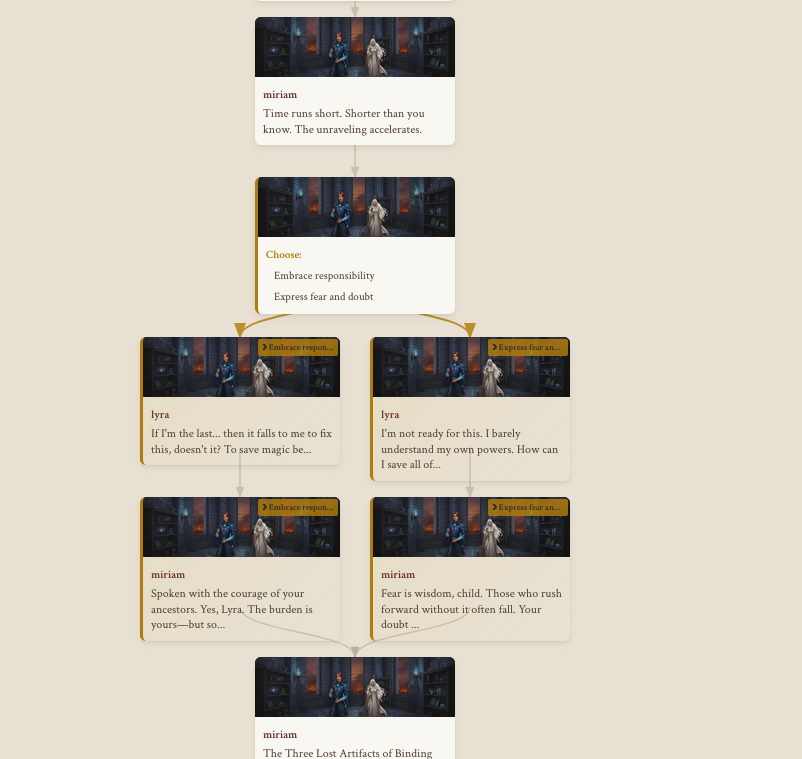
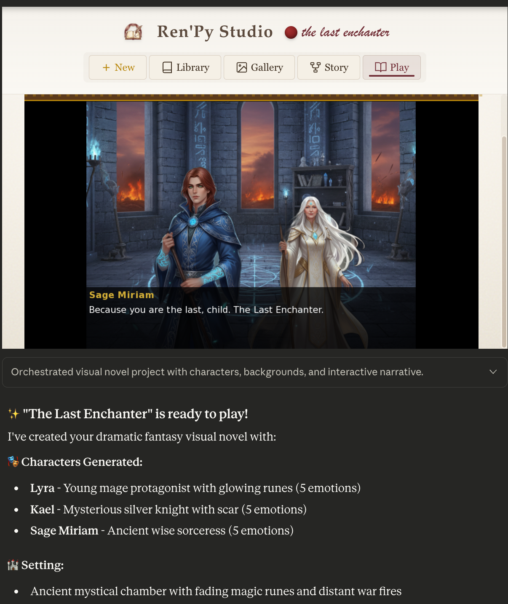
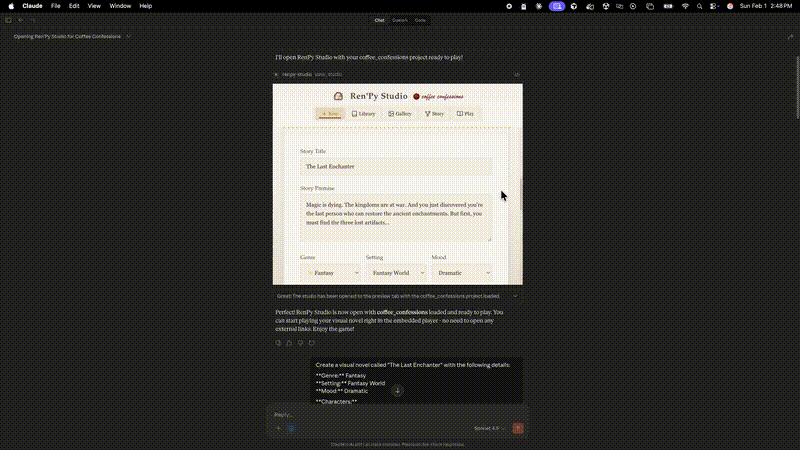

# RenPy Studio

An **MCP App** for creating visual novels directly inside Claude Desktop. Design characters, generate backgrounds, write dialogue, and play your game — all with AI-powered assistance.

[](https://www.npmjs.com/package/renpy-studio)  



## Features

- **Story Creation Wizard** - Define your story's title, premise, genre, and characters in a guided flow
- **AI Character Generation** - Create character sprites with multiple emotions using Gemini
- **AI Background Generation** - Generate scene backgrounds that match your story's mood
- **Visual Story Builder** - See your story flow with branching paths and choice visualization
- **Asset Gallery** - Browse characters and backgrounds with emotion variants and metadata
- **Web Preview** - Build and play your game directly in the browser

### Feature Gallery

| Asset Gallery | Background Generation |
|:---:|:---:|
|  |  |
| Browse characters with emotion variants | AI-generated scene backgrounds |

| Character Generation | Visual Story Builder |
|:---:|:---:|
|  |  |
| Generate sprites with 5 emotion variants | Visualize story flow with branches and merges |

| Play Your Game |
|:---:|
|  |
| Build and play your visual novel in a theatrical stage |

### See It In Action



## Installation (Claude Desktop)

Add RenPy Studio to your Claude Desktop configuration:

**macOS**: `~/Library/Application Support/Claude/claude_desktop_config.json`
**Windows**: `%APPDATA%\Claude\claude_desktop_config.json`

```json
{
  "mcpServers": {
    "renpy-studio": {
      "command": "npx",
      "args": ["-y", "renpy-studio", "--stdio"],
      "env": {
        "GEMINI_API_KEY": "your-gemini-api-key"
      }
    }
  }
}
```

Get a Gemini API key from [Google AI Studio](https://aistudio.google.com/apikey).

Then restart Claude Desktop. The `view_studio` tool will be available.

## Usage

1. **Open the studio**: Ask Claude to "open RenPy Studio" or "create a visual novel"
2. **Create a story**: Use the wizard to define your story, or pick a quick-start template
3. **Generate assets**: Claude will create characters and backgrounds using Gemini
4. **Write dialogue**: Let Claude write scripts with choices and branching paths
5. **Visualize**: See your story flow in the visual story builder
6. **Play your game**: Click "Play" to build and preview your visual novel

## Sample Prompts

Once you have RenPy Studio installed, try these prompts with Claude:

### Getting Started
- "Open RenPy Studio"
- "Create a new visual novel"
- "Show me my projects"

### Story Creation
- "Create a romance visual novel set in a coffee shop"
- "I want to make a mystery game at a university"
- "Make a slice-of-life story about a bookstore"

### Character Design
- "Add a cheerful barista character with brown hair"
- "Create a mysterious transfer student"
- "Generate a character named Alex with glasses and a shy personality"

### Background Generation
- "Create a cozy cafe interior for the afternoon"
- "Generate a cherry blossom park at sunset"
- "Make a rainy city street at night"

### Script Writing
- "Write the opening scene where the protagonist meets the love interest"
- "Add a choice where the player decides to confess or stay silent"
- "Continue the story with a plot twist"

### Building & Playing
- "Build my project and let me play it"
- "Preview my visual novel"
- "Start the game"

## Configuration

| Environment Variable | Default | Description |
|---------------------|---------|-------------|
| `GEMINI_API_KEY` | (required) | API key for Gemini image generation |
| `RENPY_SDK_PATH` | (auto-downloaded) | Path to Ren'Py SDK (optional, auto-provisioned) |
| `PORT` | `3001` | HTTP server port (for development) |

## How It Works

RenPy Studio is an **MCP App** - a special type of MCP server that also renders a UI. When you call the `view_studio` tool, Claude Desktop displays the studio interface in an embedded panel.

### Architecture


### Asset Generation Flow



### Visual Story Builder

The story builder parses Ren'Py scripts and displays the story flow as a visual graph:

- **Beat Cards**: Each dialogue line, narration, or choice is shown as a card
- **Branching**: Menus (choices) split into multiple paths
- **Merging**: Branches reconnect at continuation points
- **Visual State**: Cards show background and character states at each moment



This helps visualize complex branching narratives with multiple choice points.

## MCP Tools

| Tool | Description |
|------|-------------|
| `view_studio` | Opens the RenPy Studio UI |
| `list_projects` | Lists all visual novel projects |
| `create_project` | Creates a new project with Ren'Py structure |
| `delete_project` | Deletes a project and all its files |
| `generate_character` | Generates character sprites with emotions |
| `generate_background` | Generates background images |
| `generate_script` | Writes a Ren'Py script file |
| `build_project` | Compiles project to playable web game |
| `start_preview` | Starts the preview server |
| `get_script_graph` | Parses scripts and returns story structure |

## Data Storage

RenPy Studio stores data in `~/.renpy-studio/`:


## Development

```bash
# Clone the repo
git clone https://github.com/banjtheman/renpy_mcp_server.git
cd renpy_mcp_server/renpy_mcp_app

# Install dependencies
npm install

# Build everything
npm run build

# Run in HTTP mode (for testing with basic-host)
GEMINI_API_KEY=your-key npm run serve

# Development watch mode
npm run dev
```

### Local Development with Claude Desktop

To test local changes in Claude Desktop, use `main.ts` with tsx:

```json
{
  "mcpServers": {
    "renpy-studio": {
      "command": "npx",
      "args": ["--silent", "tsx", "/path/to/renpy_mcp_server/renpy_mcp_app/src/main.ts", "--stdio"],
      "env": {
        "GEMINI_API_KEY": "your-gemini-api-key"
      }
    }
  }
}
```

This runs TypeScript directly without needing to rebuild after each change.

### Testing with basic-host

```bash
# Terminal 1: Run RenPy Studio
GEMINI_API_KEY=your-key npm run serve

# Terminal 2: Clone and run basic-host
git clone --depth 1 https://github.com/modelcontextprotocol/ext-apps.git /tmp/mcp-ext-apps
cd /tmp/mcp-ext-apps/examples/basic-host
npm install
SERVERS='["http://localhost:3001/mcp"]' npm run start
# Open http://localhost:8080
```

## Troubleshooting

**Studio not loading?**
- Make sure you've run `npm run build` to create the bundled UI
- Check that `dist/ui/index.html` exists

**Asset generation failing?**
- Verify your `GEMINI_API_KEY` is valid
- Check the logs for Gemini API errors

**Build failing?**
- The Ren'Py SDK is auto-downloaded on first run
- Check logs for SDK download issues

**Check the logs:**
- macOS: `~/Library/Logs/Claude/mcp-server-renpy-studio.log`
- Windows: `%APPDATA%\Claude\logs\mcp-server-renpy-studio.log`

## License

MIT

## Credits

Built with:
- [MCP Apps SDK](https://github.com/modelcontextprotocol/ext-apps) - UI rendering in Claude Desktop
- [Ren'Py](https://www.renpy.org/) - Visual novel engine
- [Gemini](https://ai.google.dev/) - AI image generation
- [React](https://react.dev/) - UI framework
